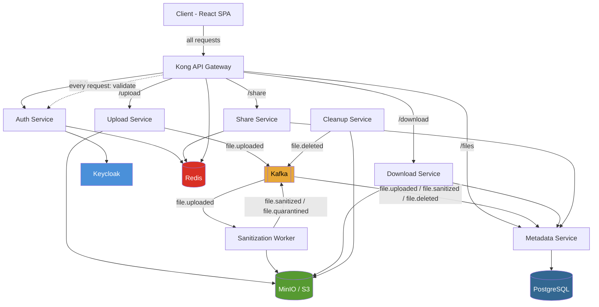
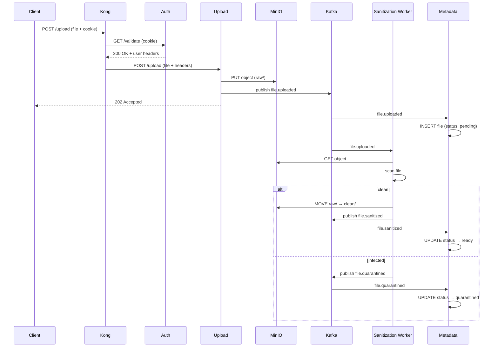
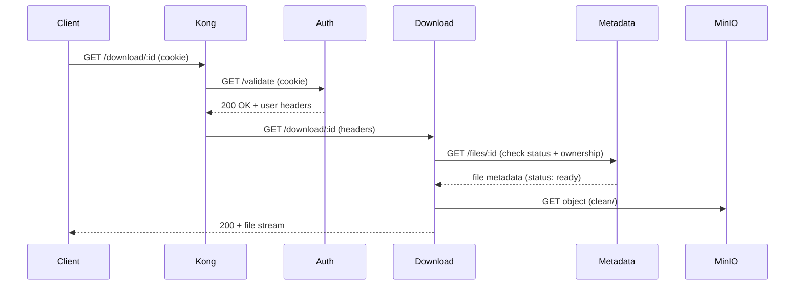
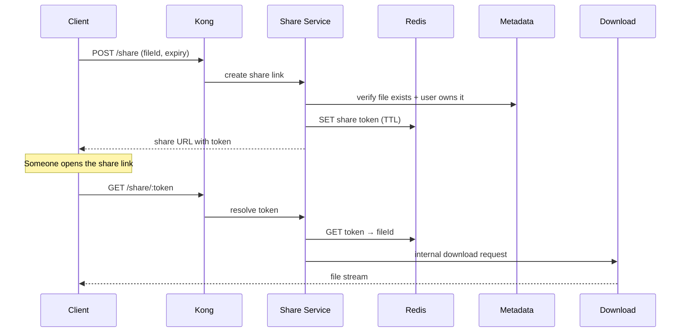

# Architecture

Secure file-sharing platform built on Go microservices, React SPA, and event-driven processing.

## Stack

- **Client** - React + TypeScript (Vite), port 5173
- **Gateway** - Kong, port 8000 (proxy) / 8001 (admin)
- **Auth Service** - Go (Gin), port 8080
- **Upload Service** - Go (Gin), port 6565
- **Download Service** - Go (Gin), port 8012
- **Metadata Service** - Go, port 8013
- **Sanitization Worker** - Go (consumer, no HTTP)
- **Cleanup Service** - Go (cron, no HTTP)
- **Share Service** - Go (Gin), port 8014
- **Keycloak** - Identity provider
- **PostgreSQL** - Metadata store
- **MinIO (S3)** - Object storage for files
- **Redis** - Session cache, rate limiting, share-link tokens
- **Kafka** - Async event bus between services

## Services

### Client
React SPA. Login, register, file upload/download UI. Talks exclusively to Kong.

### Gateway (Kong)
Single entry point. Routes requests, applies CORS, rate limiting (via Redis), and authenticates every non-public request by calling Auth `/validate` before forwarding.

### Auth Service
Login, registration, logout, token validation. Backed by Keycloak. Issues JWTs stored as HttpOnly cookies. Caches JWKS keys in Redis for fast validation.

### Upload Service
Accepts multipart file uploads. Streams the file to MinIO (S3), then publishes a `file.uploaded` event to Kafka with file metadata. Does not write to the database directly.

### Metadata Service
Owns the PostgreSQL `files` table. Listens to Kafka events (`file.uploaded`, `file.sanitized`, `file.deleted`) and keeps the database in sync. Exposes a REST API for querying file listings and details.

### Sanitization Worker
Kafka consumer. Picks up `file.uploaded` events, pulls the file from MinIO, runs antivirus/content checks, then publishes `file.sanitized` (or `file.quarantined`). No HTTP server.

### Download Service
Serves file downloads. Checks file status via Metadata Service (must be `sanitized`), verifies user permissions, then streams the file from MinIO.

### Share Service
Generates and resolves share links. Stores time-limited tokens in Redis. Validates permissions before creating a link.

### Cleanup Service
Cron job. Deletes expired/quarantined files from MinIO and publishes `file.deleted` events to Kafka so Metadata Service can update the DB.

## Infrastructure

| Component   | Role                                      |
|-------------|-------------------------------------------|
| PostgreSQL  | File metadata, user quotas                |
| MinIO (S3)  | Object storage for uploaded files         |
| Redis       | JWKS cache, rate limiting, share tokens   |
| Kafka       | Async events between services             |
| Keycloak    | Identity, users, roles, JWT signing       |

## Diagram



## Request Flows

### Upload Flow


### Download Flow


### Share Flow


## Database Schema

### `files`
| Column       | Type        | Notes                                      |
|--------------|-------------|--------------------------------------------|
| id           | UUID        | Primary key                                |
| owner_id     | VARCHAR     | Keycloak user ID                           |
| name         | VARCHAR     | Original filename                          |
| size         | BIGINT      | File size in bytes                         |
| mime_type    | VARCHAR     | Detected MIME type                         |
| status       | ENUM        | `pending`, `ready`, `quarantined`, `deleted` |
| storage_key  | VARCHAR     | Path in MinIO (e.g. `clean/uuid`)          |
| created_at   | TIMESTAMPTZ |                                            |
| updated_at   | TIMESTAMPTZ |                                            |

### `share_links`
| Column     | Type        | Notes                          |
|------------|-------------|--------------------------------|
| token      | VARCHAR     | Redis key (not stored in PG)   |
| file_id    | UUID        | FK → files.id                  |
| created_by | VARCHAR     | Keycloak user ID               |
| expires_at | TIMESTAMPTZ |                                |

> Share tokens are primarily stored in Redis with TTL. PostgreSQL row is optional audit trail.

---

## API Reference

### Auth Service — `/auth`

| Method | Path        | Auth | Description                        |
|--------|-------------|------|------------------------------------|
| POST   | /login      | No   | Login, sets HttpOnly cookie        |
| POST   | /register   | No   | Register new user                  |
| POST   | /logout     | No   | Clears auth cookie                 |
| GET    | /validate   | No   | Kong calls this to validate cookie |
| GET    | /health     | No   | Health check                       |

### Upload Service — `/upload`

| Method | Path    | Auth | Description                              |
|--------|---------|------|------------------------------------------|
| POST   | /upload | Yes  | Multipart upload, returns 202 + file ID  |
| GET    | /health | No   | Health check                             |

### Download Service — `/download`

| Method | Path           | Auth | Description                    |
|--------|----------------|------|--------------------------------|
| GET    | /download/:id  | Yes  | Stream file (must be `ready`)  |
| GET    | /health        | No   | Health check                   |

### Metadata Service — `/files`

| Method | Path       | Auth | Description                        |
|--------|------------|------|------------------------------------|
| GET    | /files     | Yes  | List files owned by current user   |
| GET    | /files/:id | Yes  | Get file metadata by ID            |
| DELETE | /files/:id | Yes  | Soft-delete, triggers cleanup flow |

### Share Service — `/share`

| Method | Path          | Auth | Description                          |
|--------|---------------|------|--------------------------------------|
| POST   | /share        | Yes  | Create share link (body: fileId, ttl)|
| GET    | /share/:token | No   | Resolve token and stream file        |
| DELETE | /share/:token | Yes  | Revoke share link                    |

---

## Error Handling & Retry Strategy

### HTTP Services
- All errors return a consistent JSON envelope:
  ```json
  { "success": false, "error": "human readable message" }
  ```
- 4xx errors are not retried (bad input, unauthorized, not found)
- 5xx errors are safe to retry with exponential backoff

### Kafka Consumers (Sanitization Worker, Metadata Service)
- Each consumer uses a **dead-letter topic** (`*.dlq`) after 3 failed attempts
- Retry backoff: 1s → 5s → 30s before sending to DLQ
- DLQ messages are logged and can be replayed manually

### Kong → Auth Validation
- If Auth Service is unreachable, Kong returns `503` — requests are not forwarded
- Auth Service JWKS cache (Redis) means validation survives short Keycloak outages

### MinIO Operations
- Upload/download retried up to 3 times with exponential backoff
- If upload to MinIO fails, the Kafka event is never published — no partial state in DB

### Kafka Publish (Upload Service)
- If Kafka publish fails after retries, the file is deleted from MinIO and a `500` is returned to the client — ensures atomicity between storage and event
