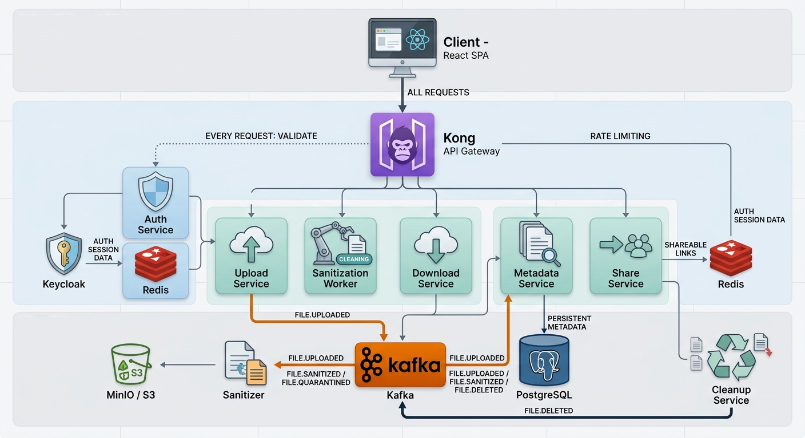

# Gokusan

A secure, event-driven file sharing platform built with Go microservices, React, and Kafka.



## Getting Started

```bash
docker compose up --build
```

| Service        | URL                        | Access   |
|----------------|----------------------------|----------|
| Client         | http://localhost:5173      | public   |
| Gateway        | http://localhost:8000      | public   |
| Kong Admin     | http://localhost:8001      | public   |
| MinIO API      | http://localhost:9000      | public   |
| MinIO Console  | http://localhost:9001      | public   |
| Keycloak       | http://localhost:8080      | public   |
| Auth Service   | http://auth:8080           | internal |
| Upload Service | http://upload:6565         | internal |
| Download Service | http://download:8012     | internal |
| Metadata Service | http://metadata:8013     | internal |
| Share Service  | http://share:8014          | internal |
| PostgreSQL     | postgres:5432              | internal |
| Redis          | redis:6379                 | internal |
| Kafka          | kafka:9092                 | internal |

## Architecture

See [ARCHITECTURE.md](./ARCHITECTURE.md) for the full system design, service breakdown, and request flow diagrams.
