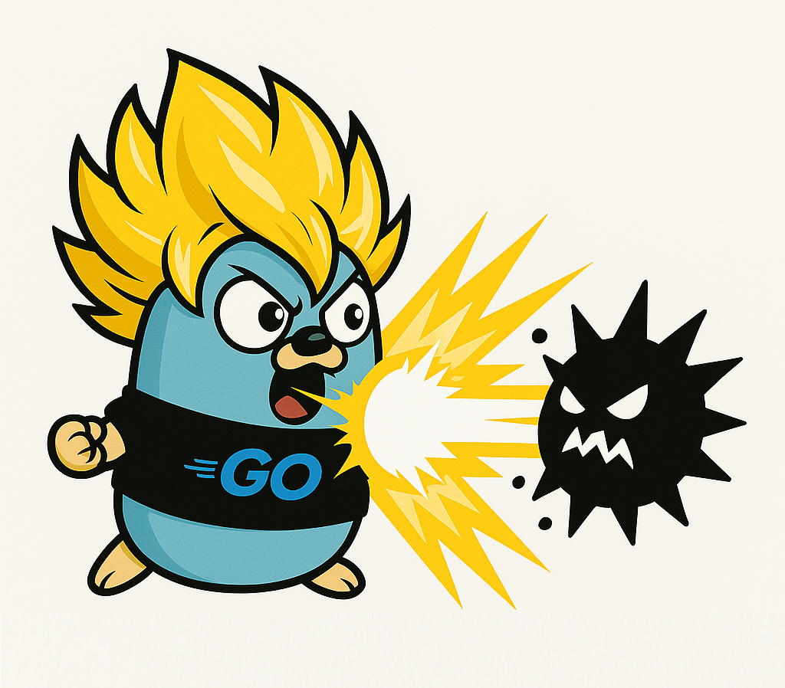

<h1 align="center">Gokusan</h1>

<p align="center">
  
</p>

<p align="center">
  Secure, event-driven file sharing platform built with Go microservices, React, and Kafka.
</p>

<p align="center">
  
  
  
  
  
  
  
</p>

---

## Overview

Gokusan is a self-hosted file sharing platform where every uploaded file is automatically sanitized via [Dangerzone](https://dangerzone.rocks) before it becomes available for download or sharing. The system is fully event-driven: services communicate through Kafka and never call each other directly for write operations.

## Stack

<table>
  <tr><th>Layer</th><th>Technology</th></tr>
  <tr><td>Frontend</td><td>React, TypeScript, Vite</td></tr>
  <tr><td>Gateway</td><td>Kong</td></tr>
  <tr><td>Services</td><td>Go 1.23+, Gin</td></tr>
  <tr><td>Auth</td><td>Keycloak, JWT, HttpOnly cookies</td></tr>
  <tr><td>Storage</td><td>MinIO (S3-compatible)</td></tr>
  <tr><td>Database</td><td>PostgreSQL 15</td></tr>
  <tr><td>Messaging</td><td>Apache Kafka</td></tr>
  <tr><td>Cache</td><td>Redis 7</td></tr>
  <tr><td>Containers</td><td>Docker, Docker Compose</td></tr>
</table>

## Getting Started

**Prerequisites:** Docker and Docker Compose

```bash
docker compose up --build
```

## Services

<table>
  <tr><th>Service</th><th>URL</th><th>Access</th></tr>
  <tr><td>Client</td><td>http://localhost:5173</td><td>public</td></tr>
  <tr><td>Gateway</td><td>http://localhost:8000</td><td>public</td></tr>
  <tr><td>Kong Admin</td><td>http://localhost:8001</td><td>public</td></tr>
  <tr><td>MinIO API</td><td>http://localhost:9000</td><td>public</td></tr>
  <tr><td>MinIO Console</td><td>http://localhost:9001</td><td>public</td></tr>
  <tr><td>Keycloak</td><td>http://localhost:8080</td><td>public</td></tr>
  <tr><td>Auth Service</td><td>http://auth:8080</td><td>internal</td></tr>
  <tr><td>Upload Service</td><td>http://upload:6565</td><td>internal</td></tr>
  <tr><td>Download Service</td><td>http://download:8012</td><td>internal</td></tr>
  <tr><td>Metadata Service</td><td>http://metadata:8013</td><td>internal</td></tr>
  <tr><td>Share Service</td><td>http://share:8014</td><td>internal</td></tr>
  <tr><td>PostgreSQL</td><td>postgres:5432</td><td>internal</td></tr>
  <tr><td>Redis</td><td>redis:6379</td><td>internal</td></tr>
  <tr><td>Kafka</td><td>kafka:9092</td><td>internal</td></tr>
</table>

## Architecture


For the full system design, service breakdown, request flow diagrams, database schema, and API reference see [ARCHITECTURE.md](./ARCHITECTURE.md).

## Project Structure

```
.
├── client/                  # React SPA (Vite)
├── gateway/                 # Kong configuration
├── services/
│   ├── auth/                # Auth service (Gin): login, register, validate
│   ├── upload/              # Upload service (Gin): multipart to MinIO + Kafka
│   ├── download/            # Download service (Gin): stream from MinIO
│   ├── metadata/            # Metadata service (Gin): owns PostgreSQL files table
│   ├── share/               # Share service (Gin): time-limited share links via Redis
│   ├── sanitization/        # Sanitization worker: Kafka consumer, runs Dangerzone
│   └── cleanup/             # Cleanup worker: cron job, purges deleted/quarantined files
├── infrastructure/
│   └── keycloak/            # Keycloak Docker Compose and realm config
└── docker-compose.yaml
```

## License

MIT
